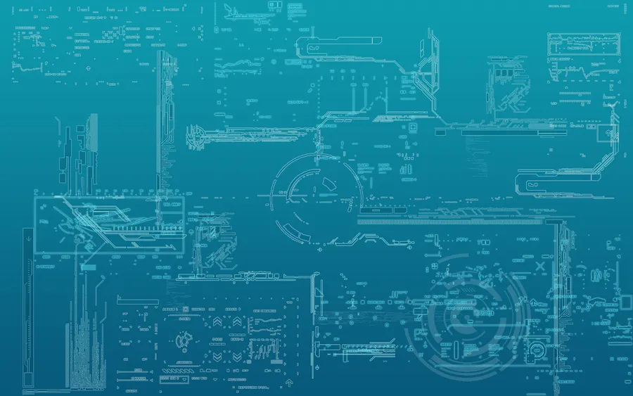

# Ederes Gure

Hello! I am @guduudow, otherwise known as Ederes! I am currently a student in Humber College's Web Development Post Graduate program, where I am learning all the essential tools needed in a web developer's kit such as HTML, CSS, JavaScript, MySQL, PHP and more! I have long been amazed by the power of the internet and am excited at the opportunity at joining this ever expanding world. I am looking expand my learning beyond schooling and seek hands-on time whenever I can, you reach me on reach me on [ LinkedIn](https://www.linkedin.com/in/ederes-gure-383b87223/)

# Current Levels in Languages
|Language|Level (1-5)|
|:-----:|:----:|
|HTML|3|
|CSS|2|
|JavaScript|3|
|C#|1|
|SQL|3|

# Why Web Development? 🤨

The technology behind web development is constantly changing and provides so many interesting opportunities. Growing browsing and seeing so many cool and interesting designs has only made me more curious about web technologies, and I hope to work in it!

<!---
jaalle1/jaalle1 is a ✨ special ✨ repository because its `README.md` (this file) appears on your GitHub profile.
You can click the Preview link to take a look at your changes.
--->
