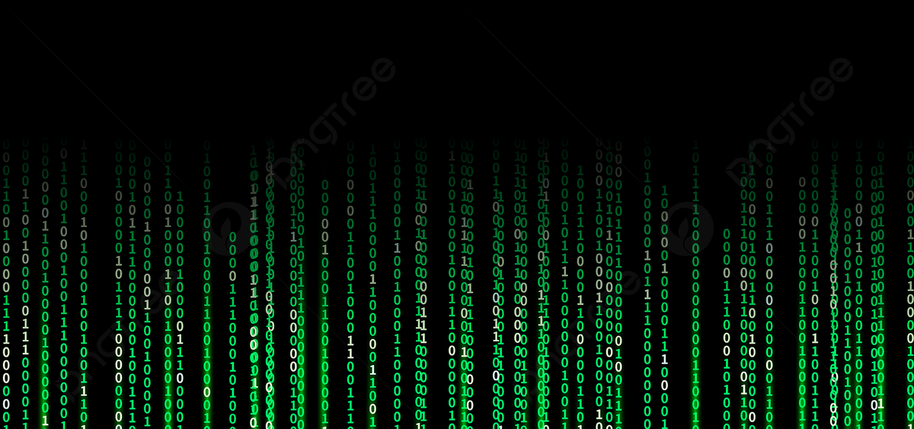

# Ederes Gure

 

- 👋 Hi, I’m @guduudow otherwise known as Ederes!
- 👀 I’m interested in the world of web development and hope to become a full stack dev
- 🌱 I’m currently learning HTML, CSS, JavaScript, C#, SQL in Humber College's Web Development Post Graduate Program
- 💞️ I’m looking to collaborate on everything related to web dev, in order to learn 📚 as much as possible
- 📫 Reach me on [ LinkedIn](https://www.linkedin.com/in/ederes-gure-383b87223/)

# Current Levels in Languages
|Language|Level (1-5)|
|:-----:|:----:|
|HTML|2|
|CSS|2|
|JavaScript|2|
|C#|1|
|SQL|1|

# Why Web Development? 🤨

The technology behind web development is constantly changing and provides so many interesting opportunities. Growing browsing and seeing so many cool and interesting designs has only made me more curious about web technologies, and I hope to work in it!

<!---
jaalle1/jaalle1 is a ✨ special ✨ repository because its `README.md` (this file) appears on your GitHub profile.
You can click the Preview link to take a look at your changes.
--->
