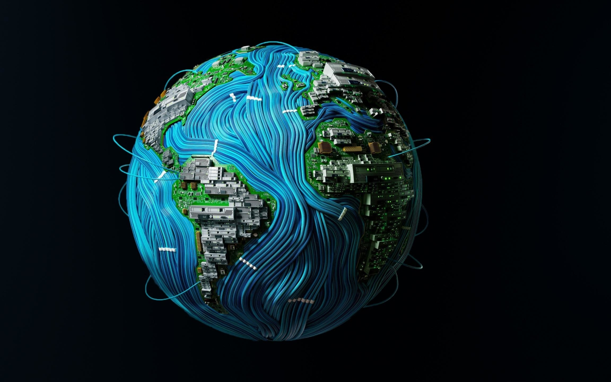

# Ederes Gure

👋 Hey there! I'm Ederes Gure, a web developer based out of Toronto, Ontario that is passionate about turning ideas into interactive, responsive websites and web apps! 💻✨

🚀 What I love building:

- Frontend Magic: Crafting sleek UIs with HTML, CSS, JavaScript, React, and Next.js 🎨
- Backend Power: Building strong, scalable servers using Node.js, Express, and databases like MongoDB & MySQL ⚙️🔗
- API Wizardry: Designing & consuming RESTful APIs with seamless third-party integrations 🌐🛠️
- Collaboration: Teamwork with Git, GitHub, and agile workflows to bring projects to life 🚧🤝

🔭 Always down with exploring new tech and challenging myself with fun projects. Ready to delve into a new work environment and see how others tackle problems. Check out my work and let’s create something amazing together! 👨‍💻

<!---
jaalle1/jaalle1 is a ✨ special ✨ repository because its `README.md` (this file) appears on your GitHub profile.
You can click the Preview link to take a look at your changes.
--->
